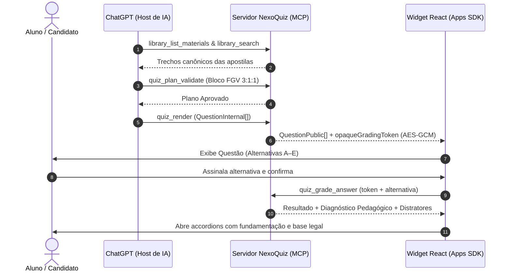

# NexoQuiz ⚖️

<div align="center">


-success)

**Engine de Questões Jurídicas Interativas para Magistratura e ENAM via Model Context Protocol (MCP) e ChatGPT Apps SDK**

</div>

---

## 📌 Visão Geral

O **NexoQuiz** é uma plataforma determinística e host-agnóstica de avaliação jurídica digital. Ele transforma apostilas canônicas em Markdown em simulados interativos de alto nível para carreiras jurídicas (ENAM, Magistratura, Ministério Público e Defensoria).

A aplicação opera integrada nativamente ao **ChatGPT** através do **MCP (Model Context Protocol)** e do **Apps SDK**, mantendo uma separação estrita de responsabilidades: o modelo de IA formula os simulados com base nas apostilas, enquanto o servidor valida contratos pedagógicos, protege os gabaritos criptograficamente e realiza a correção determinística sem alucinações.

---

## 🏛️ Invariantes Arquiteturais e Pilares

1. **Host-Agnostic no Core**:
   - Todo o núcleo de domínio (`src/core/`) é 100% puro e independente. Não há acoplamento ou dependência de SDKs externos de IA.
2. **Zero Chamadas de LLM no Backend**:
   - O backend não realiza requisições para APIs de IA. O ChatGPT atua como cliente inteligente que consome as ferramentas do servidor.
3. **Biblioteca Canônica em Markdown**:
   - As apostilas e leis residem em arquivos Markdown estruturados com frontmatter Zod e parser AST `unified/remark`, indexados via SQLite FTS5 para busca lexical ultrarrápida.
4. **Proteção Criptográfica do Gabarito (`opaqueGradingToken`)**:
   - O objeto público entregue ao host (`QuestionPublic`) **nunca** contém a resposta correta ou justificativas. O gabarito trafega cifrado em AES-256-GCM para correção stateless.
5. **Interface Digital Sóbria (Sem Gamificação)**:
   - Foco absoluto em uma experiência de prova digital limpa e técnica (alternativas A–E com seleção e confirmação explícitas, cronômetro, accordions de distratores e relatório analítico de erros).
6. **Regras Pedagógicas FGV em Código**:
   - Validação determinística do bloco 3:1:1 (3 casos narrativos, 1 proposições, 1 conceitual; 3 difíceis, 1 média, 1 fácil) e rotação de letras sem gabaritos consecutivos duplicados.

---

## 🔄 Fluxo de Funcionamento



---

## 🛠️ Ferramentas MCP Disponíveis

| Família | Ferramenta | Descrição |
| :--- | :--- | :--- |
| **Biblioteca** | `library_list_materials` | Lista o catálogo de apostilas disponíveis. |
| **Biblioteca** | `library_get_outline` | Retorna a árvore hierárquica de tópicos da matéria. |
| **Biblioteca** | `library_search` | Busca lexical ranqueada por SQLite FTS5. |
| **Biblioteca** | `library_read_sections` | Recupera o texto integral de seções selecionadas. |
| **Planejamento** | `quiz_plan_template` | Emite a estrutura modelo de um bloco de 5 questões. |
| **Planejamento** | `quiz_plan_validate` | Valida deterministicamente as proporções pedagógicas FGV. |
| **Renderização** | `quiz_render` | Entrega o widget React com token de gabarito cifrado. |
| **Correção** | `quiz_grade_answer` | Corrige a resposta e emite diagnóstico detalhado do equívoco. |
| **Persistência** | `quiz_get_history` | Consulta o histórico de tentativas e acurácia por matéria. |
| **Persistência** | `quiz_save_session` | Grava o resultado consolidado do simulado no SQLite local. |

---

## 🚀 Como Executar Localmente

### 1. Pré-requisitos
- Node.js 22+ instalado.

### 2. Instalação das Dependências
```bash
npm install
```

### 3. Execução dos Testes e Validações
```bash
# Executar a suíte completa de 54 testes unitários e de integração
npm test

# Executar a verificação End-to-End da jornada do quiz
npm run verify:e2e

# Verificar tipagem TypeScript estrita
npm run typecheck
```

### 4. Iniciar o Servidor MCP
```bash
# Compilar o widget React
npm run build:view

# Iniciar o servidor HTTP Streamable MCP na porta 3001
npm start
```
*O endpoint MCP estará escutando em `http://localhost:3001/mcp`.*

### 5. Iniciar o Portal de Documentação (VitePress)
```bash
npm run docs:dev
```
*Acesse a documentação completa em `http://localhost:5173`.*

---

## 📂 Estrutura do Projeto

```
nexoquiz/
├── src/
│   ├── core/                  # Núcleo 100% puro e Host-Agnostic
│   │   ├── domain/            # Contratos canônicos Zod (Question, Plan, UMT, Session)
│   │   ├── library/           # Parser Markdown AST e Indexador SQLite FTS5
│   │   ├── quiz/              # Validadores FGV, rotação e serviço de correção
│   │   ├── persistence/       # Repositório SQLite nativo de sessões e métricas
│   │   └── security/          # Criptografia AES-256-GCM (opaqueGradingToken)
│   ├── adapters/mcp/          # Registro de ferramentas MCP
│   ├── nexoquiz-server.ts     # Fábrica unificada do servidor MCP
│   ├── index.ts               # Servidor HTTP Express com Streamable MCP
│   └── stdio.ts               # Ponto de entrada stdio para clientes desktop
├── view/                      # Frontend React sóbrio (ChatGPT Apps SDK)
│   ├── src/
│   │   ├── components/        # QuestionPlayer, AlternativeList, CorrectionPanel, ResultsScreen
│   │   ├── store/             # Zustand store sincronizado com widgetState
│   │   └── QuizApp.tsx        # Container com ErrorBoundary e tema automático
│   └── vite.config.ts         # Configuração de build para bundle HTML único
├── library/                   # Apostilas canônicas em Markdown (.md)
├── docs/                      # Documentação completa, ADRs 001-010 e Guias
└── tests/                     # 54 testes automatizados de unidade, segurança e integração
```

---

## 📄 Licença

Distribuído sob a licença MIT. Consulte `LICENSE` para mais detalhes.
